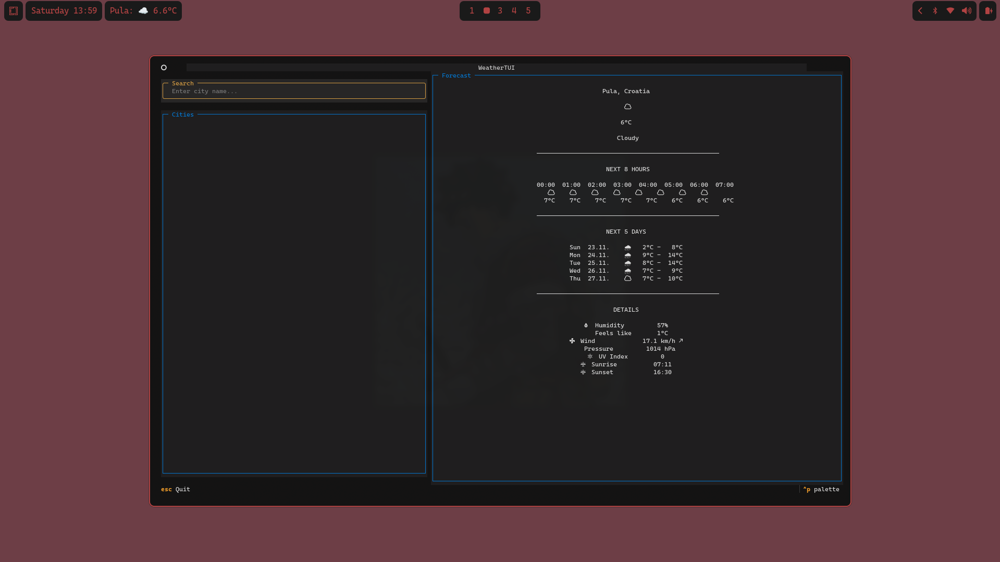

# Weather TUI

A minimalist terminal weather application for Hyprland/Waybar with interactive forecast viewer.



## Features

- 🌤️ **Current weather** - Temperature, conditions, feels like
- ⏰ **8-hour forecast** - Hourly breakdown for today
- 📅 **5-day forecast** - Daily min/max temperatures
- 💨 **Detailed info** - Wind, humidity, pressure, UV index
- 🌅 **Sunrise/sunset** - Times for current location
- 🔍 **City search** - Find any city worldwide
- 💾 **Smart caching** - Reduces API calls (10min cache)
- 🎨 **Theme-aware** - Follows terminal color scheme
- ⚡ **Fast & lightweight** - Minimal dependencies

## Requirements

- Python 3.8+
- Waybar (optional, for bar integration)
- Hyprland (optional, for floating window)
- Terminal: Alacritty, Kitty, or Ghostty
- Nerd Font (for weather icons)

## Installation

### Quick Install
```bash
cd ~/.config
git clone https://github.com/yourusername/weather-tui weather
cd weather
chmod +x install.sh
./install.sh
```

### Manual Install
```bash
# Install dependencies
pip install -r requirements.txt

# Make scripts executable
chmod +x scripts/launch_tui.sh

# Run TUI
python3 src/tui.py
```

## Waybar Integration

Add to your `~/.config/waybar/config.jsonc`:
```json
"custom/weather": {
    "exec": "python3 ~/.config/weather/scripts/weather_waybar.py",
    "return-type": "json",
    "interval": 900,
    "on-click": "~/.config/weather/scripts/launch_tui.sh"
}
```

Add `"custom/weather"` to your modules list.

## Hyprland Floating Window

Add to `~/.config/hypr/hyprland.conf`:
```conf
# Weather TUI popup
windowrulev2 = float, class:(weather-tui)
windowrulev2 = size 70% 80%, class:(weather-tui)
windowrulev2 = center, class:(weather-tui)
windowrulev2 = animation slide, class:(weather-tui)
```

Reload Hyprland: `hyprctl reload`

## Usage

### Keyboard Shortcuts

| Key | Action |
|-----|--------|
| `Tab` | Switch focus between search and forecast |
| `↑` `↓` | Navigate city list / Scroll forecast |
| `Enter` | Select city from list |
| `s` | Set current city as default |
| `q` / `Esc` | Quit |

### City Search

1. Type city name in search field (min 2 characters)
2. Results appear automatically (debounced)
3. Press Enter or use arrows + Enter to select
4. Press `s` to save as default city

### Default City

The default city is loaded on startup and used in Waybar. 

Config stored in: `~/.config/weather/config.json`

## Configuration

### config.json
```json
{
  "default_city": {
    "name": "Zagreb",
    "lat": 45.815,
    "lon": 15.982,
    "country": "Croatia"
  }
}
```

### Cache

Forecast data is cached for 10 minutes to reduce API calls.

Cache location: `~/.cache/weather/forecast_cache.json`

To clear cache: `rm ~/.cache/weather/forecast_cache.json`

## API

Uses [Open-Meteo](https://open-meteo.com/) API:
- ✅ Free & open source
- ✅ No API key required
- ✅ No rate limits for reasonable use
- ✅ Reliable & fast

## Project Structure
```
~/.config/weather/
├── README.md
├── requirements.txt
├── install.sh
├── config.json
├── scripts/
│   ├── weather_waybar.py    # Waybar module
│   └── launch_tui.sh        # TUI launcher
└── src/
    ├── api.py               # API interactions
    ├── cache.py             # Caching system
    ├── config.py            # Configuration
    └── tui.py               # Main TUI app
```

## Troubleshooting

### "Module not found" error

Make sure you're in the weather directory:
```bash
cd ~/.config/weather
python3 src/tui.py
```

### Waybar shows "Error"

Check if script is executable:
```bash
chmod +x scripts/weather_waybar.py
```

Test manually:
```bash
python3 scripts/weather_waybar.py
```

### No internet connection

The app requires internet to fetch weather data. Cache will be used if available.

### Wrong city shown

Edit `~/.config/weather/config.json` or press `s` in TUI to set new default.

## Contributing

Contributions welcome! Please:
1. Fork the repository
2. Create a feature branch
3. Make your changes
4. Submit a pull request

## Credits

- Weather data: [Open-Meteo](https://open-meteo.com/)
- TUI framework: [Textual](https://github.com/Textualize/textual)
- Icons: [Nerd Fonts](https://www.nerdfonts.com/)
